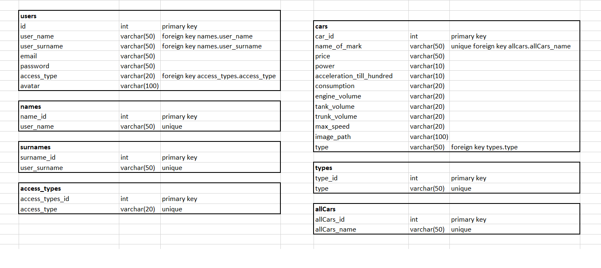
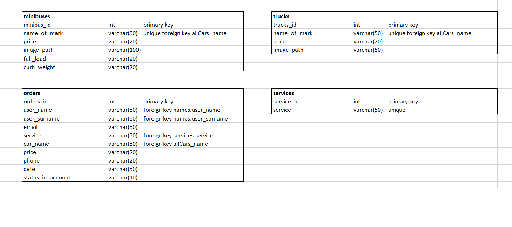

1.Незарегистрированный - имеет возможность зарегистрироваться(для регистрации на сайте пользователь должен указать свой адрес электронной почты и подтвердить, что у него есть доступ к этой почте - для активации профиля нужно ввести в специальную форму присланный на почту код), просматривать сайт, оформить заказ через форму(получить уведомление о том, что заказ готов к тому, чтобы его забрать).

2.Зарегистрированный - имеет возможность войти, сделать заказ автомобиля, тест-драйва либо сервиса с помощью своего аккаунта(т.е. форма будет заполняться в соответствии с информацией о аккаунте + доп.уведомление о готовности заказа в профиль); в своем профиле может просматривать историю заказов(полезная вещь, если человек хочет отслеживать состояние своего авто и контролировать когда в последний раз он гонял его на сервис).

3.Администратор - добавление и удаление товара или изменение описания товара, имеет доступ к списку пользователей, может повысить пользователя до администратора, имеет доступ к списку заказов.

